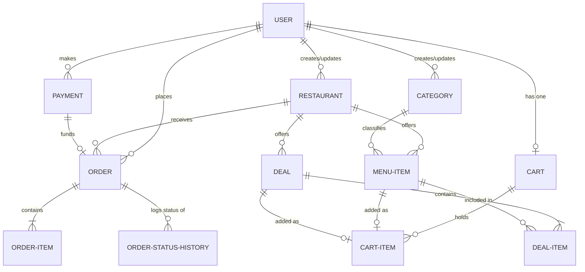

# Food Ordering System Backend Documentation

This document provides a comprehensive overview of the backend services, database schema, authentication mechanisms, and API endpoints for the **Food Ordering System**.

---

## 1. System Architecture Overview

The backend is built using the **Django Web Framework** and **Django REST Framework (DRF)**. It leverages **SQLite** as its relational database (configurable for PostgreSQL/MySQL in production) and utilizes **JSON Web Tokens (JWT)** for secure stateless authentication.

### Core Stack
- **Framework:** Django 6.0+ & Django REST Framework
- **Authentication:** `djangorestframework-simplejwt` (JWT-based auth)
- **CORS Headers:** `django-cors-headers`
- **Documentation:** `drf-yasg` (Auto-generated Swagger/OpenAPI docs)
- **Database:** SQLite (Default dev configuration)
- **Image Storage:** Pillow (Handles restaurant and menu item images)

---

## 2. Database Models & ER Schema

The database schema is organized into three primary applications: `user`, `restaurants`, and `order`.



### 2.1. User App Models

#### `User` (Custom User Model)
Extends `AbstractBaseUser` and `PermissionsMixin` to use the email address as the primary unique identifier.
- `id` (int, PK)
- `username` (varchar, required for registration)
- `email` (email, unique, primary username field)
- `city` (varchar, optional)
- `country` (varchar, optional)
- `is_active` (boolean, default: True)
- `is_admin` (boolean, default: False)
- `is_approved` (boolean, default: False)
- `created_at` / `updated_at` (datetime)

### 2.2. Restaurants App Models

#### `Category`
Represents classification of food (e.g., Chinese, Italian, Desserts).
- `id` (int, PK)
- `name` (varchar, unique)
- `slug` (slug, unique, auto-generated using `slugify` on save)
- `created_by` / `updated_by` (FK to `User`, on_delete=SET_NULL)
- `created_at` / `updated_at` (datetime)

#### `Restaurants`
Represents a physical restaurant branch.
- `id` (int, PK)
- `name` (varchar)
- `description` (text)
- `address` (varchar)
- `image` (image path, uploaded to `restaurants/`)
- `is_featured` (boolean, default: False)
- `is_active` (boolean, default: True)
- `created_by` / `updated_by` (FK to `User`, on_delete=SET_NULL)
- `created_at` / `updated_at` (datetime)

#### `MenuItem`
Food dishes belonging to a restaurant and category.
- `id` (int, PK)
- `restaurant_id` (FK to `Restaurants`, on_delete=CASCADE, related_name="menu_items")
- `category_id` (FK to `Category`, on_delete=SET_NULL, null=True, blank=True)
- `name` (varchar)
- `description` (text)
- `price` (decimal, max_digits=8, decimal_places=2)
- `image` (image path, uploaded to `menu_items/`)
- `is_available` (boolean, default: True)
- `is_featured` (boolean, default: False)
- `created_by` / `updated_by` (FK to `User`, on_delete=SET_NULL)
- `created_at` / `updated_at` (datetime)

#### `Deal`
A bundle offer (combos/promotions) representing discount packages.
- `id` (int, PK)
- `restaurant_id` (FK to `Restaurants`, on_delete=CASCADE)
- `name` (varchar)
- `description` (text)
- `combo_price` (decimal, max_digits=8, decimal_places=2)
- `image` (image path, uploaded to `deals/`)
- `is_active` (boolean, default: True)
- `is_featured` (boolean, default: False)
- `created_by` / `updated_by` (FK to `User`, on_delete=SET_NULL)
- `created_at` / `updated_at` (datetime)

#### `DealItem`
Maps specific menu items to a particular deal with quantities.
- `id` (int, PK)
- `deal_id` (FK to `Deal`, on_delete=CASCADE)
- `menu_item_id` (FK to `MenuItem`, on_delete=CASCADE)
- `quantity` (positive int, default: 1)
- *Unique Constraints:* Unique combination of `deal_id` and `menu_item_id`.

### 2.3. Order App Models

#### `Payment`
Tracks financial transactions.
- `id` (int, PK)
- `user` (FK to `User`, on_delete=CASCADE)
- `total_amount` (decimal, max_digits=10, decimal_places=2)
- `payment_status` (choice: `pending`, `success`, `failed`, `refunded`, default: `pending`)
- `payment_method` (choice: `cash`, `stripe`, `jazzcash`, `easypaisa`, default: `cash`)
- `transaction_id` (varchar, optional)
- `created_at` / `updated_at` (datetime)

#### `Cart`
Represents an active checkout container for a user (1-to-1 relationship with User).
- `id` (int, PK)
- `user` (OneToOneField to `User`, on_delete=CASCADE)
- `updated_at` (datetime)
- *Property:* `total_price` (computes sum of all cart item subtotals)

#### `CartItem`
Individual items inside the cart. Contains either a `MenuItem` or a `Deal`.
- `id` (int, PK)
- `cart` (FK to `Cart`, on_delete=CASCADE)
- `menu_item` (FK to `MenuItem`, on_delete=CASCADE, null=True, blank=True)
- `deal` (FK to `Deal`, on_delete=CASCADE, null=True, blank=True)
- `quantity` (positive int, default: 1)
- *Unique Constraints:* `("cart", "menu_item")` and `("cart", "deal")`.
- *Property:* `subtotal` (computes price * quantity based on item type)

#### `Order`
Placed orders waiting for execution/delivery.
- `id` (int, PK)
- `user` (FK to `User`, on_delete=CASCADE)
- `restaurant` (FK to `Restaurants`, on_delete=CASCADE)
- `payment` (FK to `Payment`, on_delete=SET_NULL, null=True)
- `total_price` (decimal, max_digits=10, decimal_places=2)
- `current_status` (choice: `pending`, `accepted`, `preparing`, `out_for_delivery`, `delivered`, `cancelled`, default: `pending`)
- `delivery_address` (varchar)
- `created_at` / `updated_at` (datetime)

#### `OrderItem`
Snapshot details of the products ordered at the time the order was placed.
- `id` (int, PK)
- `order` (FK to `Order`, on_delete=CASCADE)
- `menu_item` (FK to `MenuItem`, on_delete=SET_NULL, null=True)
- `deal` (FK to `Deal`, on_delete=SET_NULL, null=True)
- `quantity` (positive int, default: 1)
- `price_at_order` (decimal)
- *Property:* `subtotal` (price_at_order * quantity)

#### `OrderStatusHistory`
Tracks lifecycle updates of an order status for transparency and analytical reporting.
- `id` (int, PK)
- `order` (FK to `Order`, on_delete=CASCADE)
- `status` (choices matching `Order.current_status`)
- `changed_by` (FK to `User`, on_delete=SET_NULL, null=True)
- `timestamp` (datetime)

---

## 3. Authentication & Authorization

All secure API endpoints rely on **JSON Web Tokens (JWT)**.
- **Headers:** Authorization headers must follow the standard bearer format:
  ```http
  Authorization: Bearer <your_access_token>
  ```
- **Token Lifetimes:** 
  - Access Token: `24 hours`
  - Refresh Token: `24 hours`
- **Permissions:** 
  - Admin/Manager routes use `rest_framework.permissions.IsAdminUser` (validates `is_admin` property).
  - User routes use `rest_framework.permissions.IsAuthenticated`.

---

## 4. API Endpoints

### 4.1. User App (`/user/`)

#### Register User
* **Endpoint:** `POST /user/register/`
* **Authentication:** Public
* **Request Payload:**
  ```json
  {
    "email": "user@example.com",
    "username": "johndoe",
    "password": "securepassword",
    "confirm_password": "securepassword",
    "city": "Lahore",
    "country": "Pakistan"
  }
  ```
* **Success Response (201 Created):**
  ```json
  {
    "token": {
      "refresh": "eyJ0eXAiOiJKV1QiLCJhbGciOiJIUzI1NiJ9...",
      "access": "eyJ0eXAiOiJKV1QiLCJhbGciOiJIUzI1NiJ9..."
    },
    "data": {
      "id": 1,
      "email": "user@example.com",
      "username": "johndoe",
      "is_admin": false
    },
    "message": "User Resgitered Successfully"
  }
  ```
* **Error Response (400 Bad Request):**
  ```json
  {
    "error": "both passsword should be same. "
  }
  ```

---

#### Login User
* **Endpoint:** `POST /user/login/`
* **Authentication:** Public
* **Request Payload:**
  ```json
  {
    "email": "user@example.com",
    "password": "securepassword"
  }
  ```
* **Success Response (200 OK):**
  ```json
  {
    "token": {
      "refresh": "eyJ0eXAiOiJKV1QiLCJhbGciOiJIUzI1NiJ9...",
      "access": "eyJ0eXAiOiJKV1QiLCJhbGciOiJIUzI1NiJ9..."
    },
    "data": {
      "id": 1,
      "email": "user@example.com",
      "username": "johndoe",
      "is_admin": false
    },
    "message": "User Logged In"
  }
  ```
* **Error Response (404 Not Found):**
  ```json
  {
    "error": "User not Found"
  }
  ```

---

### 4.2. Restaurants & Menu Items (`/restaurants/`)

#### Create Category
* **Endpoint:** `POST /restaurants/create-category/`
* **Authentication:** Admin Only
* **Request Payload:**
  ```json
  {
    "name": "Chinese"
  }
  ```
* **Success Response (201 Created):**
  ```json
  {
    "message": "Category Added",
    "data": {
      "id": 1,
      "name": "Chinese",
      "slug": "chinese",
      "created_at": "2026-07-08T10:00:00Z",
      "updated_at": "2026-07-08T10:00:00Z"
    }
  }
  ```

---

#### Get Restaurants by Category
* **Endpoint:** `GET /restaurants/category/<int:cat_id>`
* **Authentication:** Public
* **Success Response (200 OK):**
  ```json
  {
    "data": [
      {
        "id": 2,
        "name": "Golden Dragon",
        "image": "/media/restaurants/golden_dragon.jpg",
        "created_by": 1,
        "created_at": "2026-07-08T10:05:00Z"
      }
    ]
  }
  ```

---

#### Get All Categories
* **Endpoint:** `GET /restaurants/all-category`
* **Authentication:** Public
* **Success Response (200 OK):**
  ```json
  {
    "data": [
      {
        "id": 1,
        "name": "Chinese",
        "created_by": 1,
        "created_at": "2026-07-08T10:00:00Z"
      }
    ]
  }
  ```

---

#### Update Category
* **Endpoint:** `PATCH /restaurants/update-category/<int:cat_id>/`
* **Authentication:** Admin Only
* **Request Payload (Partial):**
  ```json
  {
    "name": "Szechuan"
  }
  ```
* **Success Response (200 OK):**
  ```json
  {
    "message": "Category Updated",
    "data": {
      "id": 1,
      "name": "Szechuan",
      "slug": "szechuan",
      "created_at": "2026-07-08T10:00:00Z",
      "updated_at": "2026-07-08T10:10:00Z"
    }
  }
  ```

---

#### Delete Category
* **Endpoint:** `DELETE /restaurants/delete-category/<int:cat_id>/`
* **Authentication:** Admin Only
* **Success Response (200 OK):**
  ```json
  {
    "message": "Category Deleted",
    "data": {
      "id": 1,
      "name": "Szechuan",
      "slug": "szechuan",
      "created_at": "2026-07-08T10:00:00Z",
      "updated_at": "2026-07-08T10:10:00Z"
    }
  }
  ```

---

#### Create Restaurant
* **Endpoint:** `POST /restaurants/create-restaurant/`
* **Authentication:** Admin Only
* **Request Payload:**
  ```json
  {
    "name": "Golden Dragon",
    "description": "Premium Chinese & Szechuan Cuisine",
    "address": "45 Main Boulevard, Lahore",
    "is_featured": true,
    "is_active": true
  }
  ```
* **Success Response (201 Created):**
  ```json
  {
    "message": "Resturant Added",
    "data": {
      "id": 2,
      "name": "Golden Dragon",
      "description": "Premium Chinese & Szechuan Cuisine",
      "address": "45 Main Boulevard, Lahore",
      "image": null,
      "is_featured": true,
      "is_active": true,
      "menu_items": [],
      "created_at": "2026-07-08T10:05:00Z",
      "updated_at": "2026-07-08T10:05:00Z"
    }
  }
  ```

---

#### Get Restaurant Details
* **Endpoint:** `GET /restaurants/restaurant/<int:rest_id>`
* **Authentication:** Public
* **Success Response (200 OK):**
  ```json
  {
    "data": {
      "id": 2,
      "name": "Golden Dragon",
      "description": "Premium Chinese & Szechuan Cuisine",
      "address": "45 Main Boulevard, Lahore",
      "image": "/media/restaurants/golden_dragon.jpg",
      "is_featured": true,
      "is_active": true,
      "menu_items": [
        {
          "id": 10,
          "name": "Kung Pao Chicken",
          "price": "12.99",
          "image": "/media/menu_items/kung_pao.jpg",
          "category": {
            "id": 1,
            "name": "Chinese",
            "created_by": 1,
            "created_at": "2026-07-08T10:00:00Z"
          }
        }
      ],
      "created_at": "2026-07-08T10:05:00Z",
      "updated_at": "2026-07-08T10:05:00Z"
    }
  }
  ```

---

#### Get All Restaurants
* **Endpoint:** `GET /restaurants/all-restaurant`
* **Authentication:** Public
* **Success Response (200 OK):**
  ```json
  {
    "data": [
      {
        "id": 2,
        "name": "Golden Dragon",
        "image": "/media/restaurants/golden_dragon.jpg",
        "created_by": 1,
        "created_at": "2026-07-08T10:05:00Z"
      }
    ]
  }
  ```

---

#### Update Restaurant
* **Endpoint:** `PATCH /restaurants/update-restaurant/<int:rest_id>/`
* **Authentication:** Admin Only
* **Request Payload (Partial):**
  ```json
  {
    "description": "Award winning Chinese restaurant."
  }
  ```
* **Success Response (200 OK):**
  ```json
  {
    "message": "Restaurant Updated",
    "data": {
      "id": 2,
      "name": "Golden Dragon",
      "description": "Award winning Chinese restaurant.",
      "address": "45 Main Boulevard, Lahore",
      "image": "/media/restaurants/golden_dragon.jpg",
      "is_featured": true,
      "is_active": true,
      "created_at": "2026-07-08T10:05:00Z",
      "updated_at": "2026-07-08T10:20:00Z"
    }
  }
  ```

---

#### Delete Restaurant
* **Endpoint:** `DELETE /restaurants/delete-restaurant/<int:rest_id>/`
* **Authentication:** Admin Only
* **Success Response (200 OK):**
  ```json
  {
    "message": "Restaurant Deleted",
    "data": {
      "id": 2,
      "name": "Golden Dragon",
      "description": "Award winning Chinese restaurant.",
      "address": "45 Main Boulevard, Lahore",
      "image": "/media/restaurants/golden_dragon.jpg",
      "is_featured": true,
      "is_active": true,
      "created_at": "2026-07-08T10:05:00Z",
      "updated_at": "2026-07-08T10:20:00Z"
    }
  }
  ```

---

#### Create Menu Item
* **Endpoint:** `POST /restaurants/create-menuitem/`
* **Authentication:** Admin Only
* **Request Payload:**
  ```json
  {
    "restaurant_id": 2,
    "category_id": 1,
    "name": "Kung Pao Chicken",
    "description": "Spicy stir-fried chicken with peanuts and vegetables",
    "price": 12.99,
    "is_available": true,
    "is_featured": true
  }
  ```
* **Success Response (201 Created):**
  ```json
  {
    "Message": "Menu Item Added",
    "data": {
      "id": 10,
      "restaurant_id": 2,
      "category_id": 1,
      "name": "Kung Pao Chicken",
      "description": "Spicy stir-fried chicken with peanuts and vegetables",
      "price": "12.99",
      "image": null,
      "is_available": true,
      "is_featured": true,
      "restaurant": {
        "id": 2,
        "name": "Golden Dragon",
        "image": "/media/restaurants/golden_dragon.jpg",
        "created_by": 1,
        "created_at": "2026-07-08T10:05:00Z"
      },
      "category": {
        "id": 1,
        "name": "Chinese",
        "slug": "chinese",
        "created_at": "2026-07-08T10:00:00Z",
        "updated_at": "2026-07-08T10:00:00Z"
      },
      "created_at": "2026-07-08T10:30:00Z",
      "updated_at": "2026-07-08T10:30:00Z"
    }
  }
  ```

---

#### Get Menu Item Details
* **Endpoint:** `GET /restaurants/menuitem/<int:menu_id>`
* **Authentication:** Public
* **Success Response (200 OK):** (Matches `data` from Create Menu Item output structure)

---

#### Get All Menu Items
* **Endpoint:** `GET /restaurants/all-menuitem`
* **Authentication:** Public
* **Success Response (200 OK):**
  ```json
  {
    "data": [
      {
        "id": 10,
        "name": "Kung Pao Chicken",
        "price": "12.99",
        "image": "/media/menu_items/kung_pao.jpg",
        "restaurant": {
          "id": 2,
          "name": "Golden Dragon",
          "image": "/media/restaurants/golden_dragon.jpg",
          "created_by": 1,
          "created_at": "2026-07-08T10:05:00Z"
        },
        "category": {
          "id": 1,
          "name": "Chinese",
          "created_by": 1,
          "created_at": "2026-07-08T10:00:00Z"
        }
      }
    ]
  }
  ```

---

#### Update Menu Item
* **Endpoint:** `PATCH /restaurants/update-menuitem/<int:menu_id>/`
* **Authentication:** Admin Only
* **Request Payload (Partial):**
  ```json
  {
    "price": 13.99
  }
  ```
* **Success Response (200 OK):**
  ```json
  {
    "message": "Updated Menu Item",
    "data": {
      "id": 10,
      "restaurant_id": 2,
      "category_id": 1,
      "name": "Kung Pao Chicken",
      "description": "Spicy stir-fried chicken with peanuts and vegetables",
      "price": "13.99",
      "image": "/media/menu_items/kung_pao.jpg",
      "is_available": true,
      "is_featured": true,
      "created_at": "2026-07-08T10:30:00Z",
      "updated_at": "2026-07-08T10:40:00Z"
    }
  }
  ```

---

#### Delete Menu Item
* **Endpoint:** `DELETE /restaurants/delete-menuitem/<int:menu_id>/`
* **Authentication:** Admin Only
* **Success Response (200 OK):**
  ```json
  {
    "message": "Menu Item Deleted",
    "data": {
      "id": 10,
      "name": "Kung Pao Chicken",
      "price": "13.99",
      "image": "/media/menu_items/kung_pao.jpg"
    }
  }
  ```

---

#### Create Deal
* **Endpoint:** `POST /restaurants/create-deal/`
* **Authentication:** Admin Only
* **Request Payload:**
  ```json
  {
    "restaurant_id": 2,
    "name": "Dragon Feast for Two",
    "description": "Get 2 Mains and a side at a discount.",
    "combo_price": 25.00,
    "is_active": true,
    "is_featured": true
  }
  ```
* **Success Response (201 Created):**
  ```json
  {
    "message": "Deal Created",
    "data": {
      "id": 3,
      "name": "Dragon Feast for Two",
      "description": "Get 2 Mains and a side at a discount.",
      "combo_price": "25.00",
      "image": null,
      "is_active": true,
      "is_featured": true,
      "created_by": 1,
      "created_at": "2026-07-08T10:45:00Z",
      "updated_at": "2026-07-08T10:45:00Z",
      "items": []
    }
  }
  ```

---

#### Get Deal Details
* **Endpoint:** `GET /restaurants/deal/<int:deal_id>/`
* **Authentication:** Public
* **Success Response (200 OK):**
  ```json
  {
    "data": {
      "id": 3,
      "name": "Dragon Feast for Two",
      "description": "Get 2 Mains and a side at a discount.",
      "combo_price": "25.00",
      "image": null,
      "is_active": true,
      "is_featured": true,
      "created_by": 1,
      "created_at": "2026-07-08T10:45:00Z",
      "updated_at": "2026-07-08T10:45:00Z",
      "items": [
        {
          "id": 1,
          "deal_id": 3,
          "quantity": 2,
          "menu_item_id": 10,
          "menu_item": {
            "id": 10,
            "name": "Kung Pao Chicken",
            "price": "13.99",
            "image": "/media/menu_items/kung_pao.jpg",
            "restaurant": {
              "id": 2,
              "name": "Golden Dragon"
            },
            "category": {
              "id": 1,
              "name": "Chinese"
            }
          }
        }
      ]
    }
  }
  ```

---

#### Get All Deals
* **Endpoint:** `GET /restaurants/all-deal/`
* **Authentication:** Public
* **Success Response (200 OK):** (Returns list containing Deal objects in the structure shown above)

---

#### Update Deal
* **Endpoint:** `PATCH /restaurants/update-deal/<int:deal_id>/`
* **Authentication:** Admin Only
* **Request Payload (Partial):**
  ```json
  {
    "combo_price": 23.00
  }
  ```
* **Success Response (200 OK):**
  ```json
  {
    "message": "Deal Updated",
    "data": {
      "id": 3,
      "name": "Dragon Feast for Two",
      "description": "Get 2 Mains and a side at a discount.",
      "combo_price": "23.00",
      "image": null,
      "is_active": true,
      "is_featured": true,
      "created_by": 1,
      "created_at": "2026-07-08T10:45:00Z",
      "updated_at": "2026-07-08T10:50:00Z"
    }
  }
  ```

---

#### Delete Deal
* **Endpoint:** `DELETE /restaurants/delete-deal/<int:deal_id>/`
* **Authentication:** Admin Only
* **Success Response (200 OK):**
  ```json
  {
    "message": "Deal Deleted"
  }
  ```

---

#### Create Deal Item
* **Endpoint:** `POST /restaurants/create-deal-item/`
* **Authentication:** Admin Only
* **Request Payload:**
  ```json
  {
    "deal_id": 3,
    "menu_item_id": 10,
    "quantity": 2
  }
  ```
* **Success Response (201 Created):**
  ```json
  {
    "message": "Deal Item Added",
    "data": {
      "id": 1,
      "deal_id": 3,
      "menu_item_id": 10,
      "quantity": 2
    }
  }
  ```

---

#### Get Deal Item
* **Endpoint:** `GET /restaurants/deal-item/<int:item_id>/`
* **Authentication:** Public
* **Success Response (200 OK):**
  ```json
  {
    "data": {
      "id": 1,
      "deal_id": 3,
      "menu_item_id": 10,
      "quantity": 2,
      "menu_item": {
        "id": 10,
        "name": "Kung Pao Chicken",
        "price": "13.99",
        "image": "/media/menu_items/kung_pao.jpg",
        "restaurant": {
          "id": 2,
          "name": "Golden Dragon"
        },
        "category": {
          "id": 1,
          "name": "Chinese"
        }
      }
    }
  }
  ```

---

#### Get All Deal Items
* **Endpoint:** `GET /restaurants/all-deal-item/`
* **Authentication:** Public
* **Success Response (200 OK):** (List of deal items)

---

#### Update Deal Item
* **Endpoint:** `PATCH /restaurants/update-deal-item/<int:item_id>/`
* **Authentication:** Admin Only
* **Request Payload (Partial):**
  ```json
  {
    "quantity": 3
  }
  ```
* **Success Response (200 OK):**
  ```json
  {
    "message": "Deal Item Updated",
    "data": {
      "id": 1,
      "deal_id": 3,
      "menu_item_id": 10,
      "quantity": 3
    }
  }
  ```

---

#### Delete Deal Item
* **Endpoint:** `DELETE /restaurants/delete-deal-item/<int:item_id>/`
* **Authentication:** Admin Only
* **Success Response (200 OK):**
  ```json
  {
    "message": "Deal Item Deleted"
  }
  ```

---

#### Global Search
* **Endpoint:** `GET /restaurants/search/?q=<query>`
* **Authentication:** Public
* **Success Response (200 OK):**
  ```json
  {
    "restaurants": [
      {
        "id": 2,
        "name": "Golden Dragon",
        "image": "/media/restaurants/golden_dragon.jpg",
        "created_by": 1,
        "created_at": "2026-07-08T10:05:00Z"
      }
    ],
    "categories": [],
    "menuitems": [
      {
        "id": 10,
        "name": "Kung Pao Chicken",
        "price": "13.99",
        "image": "/media/menu_items/kung_pao.jpg",
        "restaurant": {
          "id": 2,
          "name": "Golden Dragon",
          "image": "/media/restaurants/golden_dragon.jpg",
          "created_by": 1,
          "created_at": "2026-07-08T10:05:00Z"
        },
        "category": {
          "id": 1,
          "name": "Chinese",
          "created_by": 1,
          "created_at": "2026-07-08T10:00:00Z"
        }
      }
    ]
  }
  ```

---

### 4.3. Shopping Cart & Ordering (`/order/`)

#### Get User Cart
* **Endpoint:** `GET /order/cart/`
* **Authentication:** Authenticated
* **Success Response (200 OK):**
  ```json
  {
    "data": {
      "id": 1,
      "items": [
        {
          "id": 5,
          "name": "Kung Pao Chicken",
          "price": "13.99",
          "image": "/media/menu_items/kung_pao.jpg",
          "type": "menu_item",
          "restaurant": "Golden Dragon",
          "quantity": 1,
          "subtotal": 13.99
        }
      ],
      "total_price": 13.99,
      "updated_at": "2026-07-08T11:00:00Z"
    }
  }
  ```

---

#### Add Item to Cart
* **Endpoint:** `POST /order/cart/add/`
* **Authentication:** Authenticated
* **Request Payload (send either `menu_item_id` OR `deal_id`):**
  ```json
  {
    "menu_item_id": 10
  }
  ```
* **Success Response (200 OK):**
  ```json
  {
    "message": "Added to cart",
    "data": {
      "id": 1,
      "items": [
        {
          "id": 5,
          "name": "Kung Pao Chicken",
          "price": "13.99",
          "image": "/media/menu_items/kung_pao.jpg",
          "type": "menu_item",
          "restaurant": "Golden Dragon",
          "quantity": 2,
          "subtotal": 27.98
        }
      ],
      "total_price": 27.98,
      "updated_at": "2026-07-08T11:02:00Z"
    }
  }
  ```

---

#### Update Cart Item Quantity
* **Endpoint:** `PATCH /order/cart/update-item/<int:item_id>/`
* **Authentication:** Authenticated
* **Request Payload:**
  ```json
  {
    "quantity": 3
  }
  ```
* **Success Response (200 OK):**
  ```json
  {
    "message": "Cart item updated",
    "data": {
      "id": 5,
      "name": "Kung Pao Chicken",
      "price": "13.99",
      "image": "/media/menu_items/kung_pao.jpg",
      "type": "menu_item",
      "restaurant": "Golden Dragon",
      "quantity": 3,
      "subtotal": 41.97
    }
  }
  ```

---

#### Remove Cart Item
* **Endpoint:** `DELETE /order/cart/delete-item/<int:item_id>/`
* **Authentication:** Authenticated
* **Success Response (200 OK):**
  ```json
  {
    "message": "Item removed from cart."
  }
  ```

---

#### Checkout
* **Endpoint:** `POST /order/checkout/`
* **Authentication:** Authenticated
* **Request Payload:**
  ```json
  {
    "delivery_address": "Flat 302, Green Apartments, Lahore",
    "payment_method": "cash",
    "transaction_id": ""
  }
  ```
  *(Note: `transaction_id` is required if `payment_method` is set to `stripe`, `jazzcash`, or `easypaisa`)*
* **Success Response (201 Created):**
  ```json
  {
    "message": "Checkout complete.",
    "successful_orders": [
      {
        "restaurant": "Golden Dragon",
        "order_id": 4,
        "total": 41.97
      }
    ],
    "failed_orders": [],
    "payment": {
      "id": 6,
      "total_amount": 41.97,
      "payment_method": "cash",
      "payment_status": "pending"
    }
  }
  ```

---

#### Get User Orders List
* **Endpoint:** `GET /order/orders/`
* **Authentication:** Authenticated
* **Success Response (200 OK):**
  ```json
  {
    "data": [
      {
        "order_id": 4,
        "restaurant": {
          "id": 2,
          "name": "Golden Dragon"
        },
        "items": [
          {
            "id": 8,
            "name": "Kung Pao Chicken",
            "image": "/media/menu_items/kung_pao.jpg",
            "type": "menu_item",
            "quantity": 3,
            "price_at_order": "13.99",
            "subtotal": 41.97
          }
        ],
        "total_price": "41.97",
        "current_status": "pending",
        "delivery_address": "Flat 302, Green Apartments, Lahore",
        "status_history": [
          {
            "id": 12,
            "status": "pending",
            "changed_by": {
              "id": 2,
              "username": "johndoe",
              "email": "user@example.com"
            },
            "timestamp": "2026-07-08T11:05:00Z"
          }
        ],
        "created_at": "2026-07-08T11:05:00Z",
        "updated_at": "2026-07-08T11:05:00Z"
      }
    ]
  }
  ```

---

#### Get Order Details
* **Endpoint:** `GET /order/order/<int:order_id>`
* **Authentication:** Authenticated
* **Success Response (200 OK):** (Matches single order object from User Orders List response)

---

#### Cancel Order
* **Endpoint:** `POST /order/order/<int:order_id>/cancel/`
* **Authentication:** Authenticated
* **Success Response (200 OK):**
  ```json
  {
    "message": "Order cancelled successfully."
  }
  ```
* **Error Response (400 Bad Request):**
  ```json
  {
    "error": "Order can only be cancelled when status is pending."
  }
  ```

---

### 4.4. Admin Orders & Analytics (`/order/admin/`)

#### Get All Orders (Admin View)
* **Endpoint:** `GET /order/admin/orders`
* **Authentication:** Admin Only
* **Success Response (200 OK):** (List of all orders in system using the comprehensive `OrderSerializer` format)

---

#### Update Order Status
* **Endpoint:** `PATCH /order/admin/orders/<int:order_id>/status/`
* **Authentication:** Admin Only
* **Request Payload:**
  ```json
  {
    "status": "accepted"
  }
  ```
  *(Choices: `pending`, `accepted`, `preparing`, `out_for_delivery`, `delivered`, `cancelled`)*
* **Success Response (200 OK):**
  ```json
  {
    "message": "Order status updated.",
    "data": {
      "order_id": 4,
      "restaurant": {
        "id": 2,
        "name": "Golden Dragon"
      },
      "items": [...],
      "total_price": "41.97",
      "current_status": "accepted",
      "delivery_address": "Flat 302, Green Apartments, Lahore",
      "status_history": [
        {
          "id": 12,
          "status": "pending",
          "changed_by": { "id": 2, "username": "johndoe", "email": "user@example.com" },
          "timestamp": "2026-07-08T11:05:00Z"
        },
        {
          "id": 13,
          "status": "accepted",
          "changed_by": { "id": 1, "username": "admin", "email": "admin@example.com" },
          "timestamp": "2026-07-08T11:15:00Z"
        }
      ],
      "created_at": "2026-07-08T11:05:00Z",
      "updated_at": "2026-07-08T11:15:00Z"
    }
  }
  ```

---

#### Dashboard Overview
* **Endpoint:** `GET /order/admin/analytics/overview/`
* **Authentication:** Admin Only
* **Success Response (200 OK):**
  ```json
  {
    "data": {
      "total_orders": 142,
      "total_revenue": 3840.50,
      "active_restaurants": 12,
      "total_users": 98
    }
  }
  ```

---

#### Popular Menu Items
* **Endpoint:** `GET /order/admin/analytics/popular-items/?limit=10`
* **Authentication:** Admin Only
* **Success Response (200 OK):**
  ```json
  {
    "data": [
      {
        "menu_item__id": 10,
        "menu_item__name": "Kung Pao Chicken",
        "menu_item__price": "13.99",
        "menu_item__restaurant_id__name": "Golden Dragon",
        "total_sold": 48,
        "total_revenue": 671.52
      }
    ]
  }
  ```

---

#### Popular Deals
* **Endpoint:** `GET /order/admin/analytics/popular-deals/?limit=10`
* **Authentication:** Admin Only
* **Success Response (200 OK):**
  ```json
  {
    "data": [
      {
        "deal__id": 3,
        "deal__name": "Dragon Feast for Two",
        "deal__combo_price": "23.00",
        "deal__restaurant_id__name": "Golden Dragon",
        "total_sold": 15,
        "total_revenue": 345.00
      }
    ]
  }
  ```

---

#### Revenue by Restaurant
* **Endpoint:** `GET /order/admin/analytics/revenue-by-restaurant/`
* **Authentication:** Admin Only
* **Success Response (200 OK):**
  ```json
  {
    "data": [
      {
        "restaurant__id": 2,
        "restaurant__name": "Golden Dragon",
        "total_revenue": 1016.52,
        "total_orders": 63
      }
    ]
  }
  ```

---

#### Revenue Over Time
* **Endpoint:** `GET /order/admin/analytics/revenue-over-time/?range=daily`
* **Authentication:** Admin Only
* **Success Response (200 OK):**
  ```json
  {
    "range": "daily",
    "data": [
      {
        "period": "2026-07-08",
        "total_revenue": 450.00,
        "total_orders": 12
      }
    ]
  }
  ```

---

#### Orders Grouped by Status
* **Endpoint:** `GET /order/admin/analytics/orders-by-status/`
* **Authentication:** Admin Only
* **Success Response (200 OK):**
  ```json
  {
    "data": [
      {
        "current_status": "pending",
        "count": 5
      },
      {
        "current_status": "accepted",
        "count": 12
      },
      {
        "current_status": "delivered",
        "count": 120
      },
      {
        "current_status": "cancelled",
        "count": 5
      }
    ]
  }
  ```

---


---

## 5. Development & Execution Setup

Follow these steps to spin up the service locally:

1. **Activate Virtual Environment:**
   ```powershell
   venv\Scripts\Activate.ps1
   ```
2. **Install Dependencies:**
   ```bash
   pip install -r requirements.txt
   ```
3. **Database Migrations:**
   ```bash
   python manage.py makemigrations
   python manage.py migrate
   ```
4. **Create Admin Superuser:**
   ```bash
   python manage.py createsuperuser
   ```
5. **Run Server:**
   ```bash
   python manage.py runserver
   ```
6. **Access Interactive Swagger Interface:**
   Navigate to [http://127.0.0.1:8000/](http://127.0.0.1:8000/) to view, test, and interact with the endpoints.
